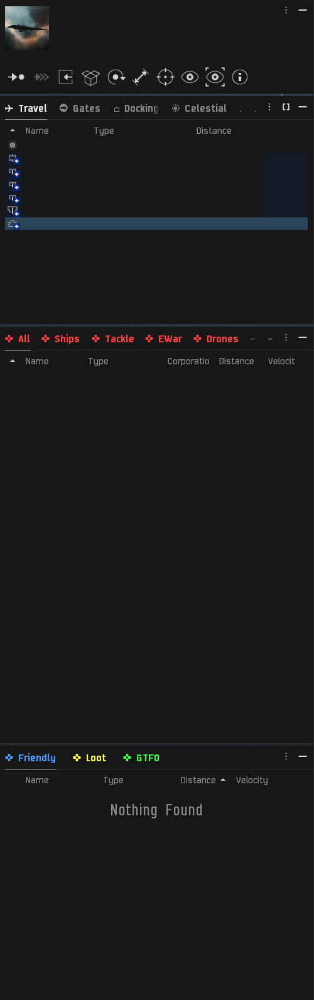

# baseline's modified Z-S Overview

Single Window is for one overview window

Multi-Window is meant for 3 as pictured below

  
Multi window example

  

---

`colors.txt` saves standard coloring schemes.

`Grouped Types.yaml` saves all groups within a category in each filter, e.g. everything under the "Asteroid" filter lists groups in the "Asteroid" type from the filters tab.

* Also saves groupings for common filters, e.g. always all bombs and bubbles

(Not sure if there's a database out there somewhere that actually lists these out.)

---

### Keep calm and /open_overview_settings